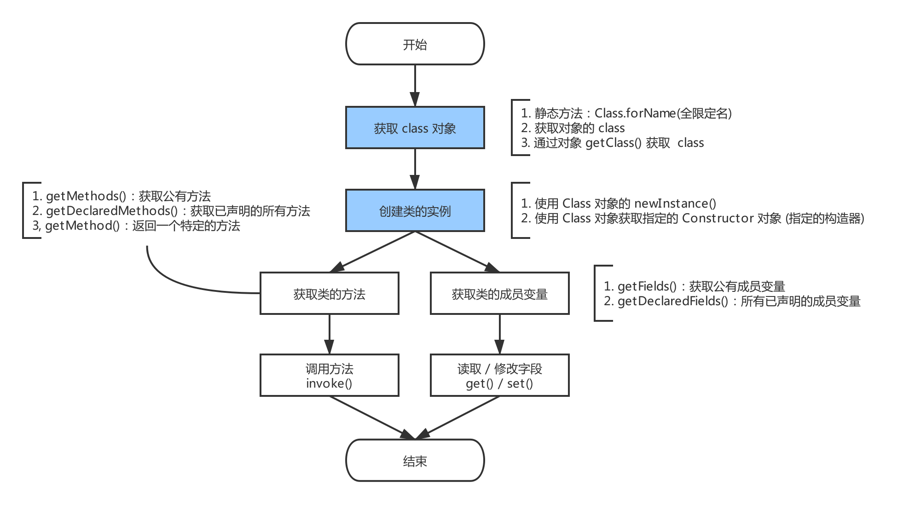
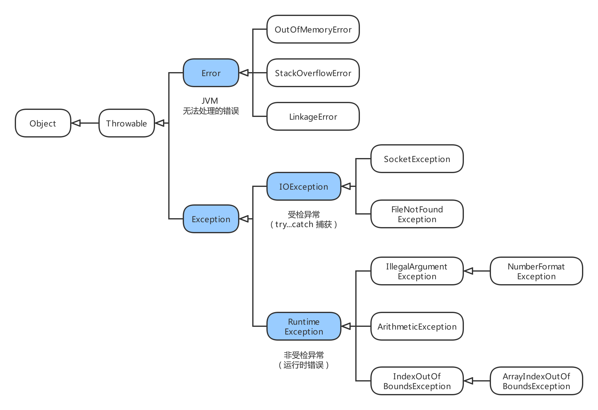

# 技术面试必备基础知识-Java-基础

> 原文：[CS-Notes-Java-基础](https://cyc2018.github.io/CS-Notes/#/notes/Java%20%E5%9F%BA%E7%A1%80)  

## 反射

> 本章内容适用于 JDK 1.8 版本。

### 章节导读

|  |
| :-: |
| 图 1-1 Java 反射的实现过程 |

### 参考资料

- [sczyh30. 深入解析 Java 反射-基础. sczyh30.com](https://www.sczyh30.com/posts/Java/java-reflection-1/)
- [伯特. Java 反射由浅入深. juejin.im](https://juejin.im/post/598ea9116fb9a03c335a99a4)
- [知乎问答. 学习 Java 应该如何理解反射. zhihu.com](https://www.zhihu.com/question/24304289)
- [Carson_Ho. Java反射机制学习指南. jianshu.com](https://www.jianshu.com/p/356e1d7a9d11)

### 基本概念

- 反射 (Reflection)：它允许 `运行中` 的 Java 程序获取自身的信息，并且可以操作 `类或对象` 的`内部属性`。

- 在 Java 程序中，对象的类型都是在编译期就确定下来的，而 Java 反射机制可以动态地创建对象并调用其属性，这样的对象的类型在编译期是未知的。

	> 反射的核心是 JVM 在运行时动态加载类或调用方法 / 访问属性。[类加载](CyC2018-CS-Notes-Java-JVM.md# 类的加载过程) 还经历了加载、验证、准备、解析和初始化这 5 个过程。

- 每个类都有一个 Class 对象，包含了与类有关的信息。当编译一个新类时，会产生一个同名的 `.class` 文件。该文件内容保存着 Class 对象。

### 反射的用途

- 在使用 IDE (如 Eclipse，IntelliJ IDEA) 时，当输入一个对象或类并想调用它的属性或方法时，只需按 “.” 号，编译器就会自动罗列它的属性或方法，实际这里就利用了反射的特性。
- 反射最重要的用途就是开发各种通用框架。很多框架 (比如 Spring) 都是配置化的 (比如通过 XML 文件配置 Bean)。为了保证框架的通用性，它们可能需要根据配置文件加载不同的对象或类，调用不同的方法，即运行时动态加载需要加载的对象。

### 实现与使用
- `类加载` 相当于 `Class` 对象的加载。也可以使用 `Class.forName("com.mysql.jdbc.Driver")` 这种方式来控制类的加载，该方法会返回一个 Class 对象。
- `Class` 和 `java.lang.reflect` 都对反射提供了支持。java.lang.reflect 类库主要包含了以下三个类：
	- `Constructor`：可以用 Constructor 的 newInstance() 创建新的对象。
	- `Field`：可以使用 get() 和 set() 方法读取和修改 Field 对象关联的字段；
	- `Method`：可以使用 invoke() 方法调用与 Method 对象关联的方法；

#### 获得 Class 对象
- 使用 Class 类的 forName() 静态方法：

	```java
	public static Class<?> forName(String className) {
		// ...
	}

	// 例如在 JDBC 开发中用此方法加载数据库驱动
	Class.forName(driver);
	```
	
- 直接获取某一个 `对象` 的 class：

	```java
	Class<?> klass = int.class;
	Class<?> classInt = Integer.TYPE;
	```

- 调用某个 `对象` 的 getClass() 方法：

	```java
	StringBuilder str = new StringBuilder("123");
	Class<?> klass = str.getClass();
	```

#### 判断所属类的实例
- 一般地，我们用 instanceof 关键字来判断是否为某个类的实例。同时我们也可以借助反射中 Class 对象的 isInstance() 方法来判断是否为某个类的实例，它是一个 native 方法：

	```java
	public native boolean isInstance(Object obj);
	```

#### 创建实例
- 使用 Class 对象的 newInstance() 方法来创建 Class 对象对应类的实例。

	```java
	Class<?> c = String.class;
	Object str = c.newInstance();
	```
	
- 先通过 Class 对象获取指定的 Constructor 对象，再调用 Constructor 对象的 newInstance() 方法来创建实例。这种方法可以用 `指定的构造器` 构造类的实例。

	```java
	// 获取 String 所对应的 Class 对象
	Class<?> c = String.class;
	// 获取 String 类带一个 String 参数的构造器
	Constructor constructor = c.getConstructor(String.class);
	// 根据构造器创建实例
	Object obj = constructor.newInstance("23333");
	System.out.println(obj);
	```

#### 获取方法
- getDeclaredMethods() 方法返回类或接口声明的 `所有方法`，包括公共、保护、默认 (包) 访问和私有方法，但不包括继承的方法。

	```java
	public Method[] getDeclaredMethods() throws SecurityException
	```
	
- getMethods() 方法返回某个类的所有 `公用方法` (public)，包括其继承类的公用方法。

	```java
	public Method[] getMethods() throws SecurityException
	```
	
- getMethod() 方法返回一个特定的方法，其中第一个参数为方法名称，后面的参数为方法的参数对应 Class 的对象。

	```java
	public Method getMethod(String name, Class<?>... parameterTypes)
	```
	
- 具体地，我们通过实例来理解这三个方法：

	```java
	package org.ScZyhSoft.common;
	import java.lang.reflect.InvocationTargetException;
	import java.lang.reflect.Method;
	public class GetMethodTest {
	    public static void main(String[] args) throws
          IllegalAccessException, InstantiationException, 
          NoSuchMethodException, InvocationTargetException {
	    
	        Class<?> c = methodClass.class;
	        Object object = c.newInstance();
	    
	        Method[] methods = c.getMethods();
	        Method[] declaredMethods = c.getDeclaredMethods();
	    
	        // getMethods() 方法获取的所有方法
	        System.out.println("getMethods 获取的方法：");
	        for(Method m:methods) {
	            System.out.println(m);
	        }
	    
	        // getDeclaredMethods()方法获取的所有方法
	        System.out.println("getDeclaredMethods 获取的方法：");
	        for(Method m:declaredMethods) {
	            System.out.println(m);
	        }

	        // 获取 Calculator 类的 add() 方法
	        Method method = c.getMethod("add", int.class, int.class);
	    }
	}

	class Calculator {
	    public final int count = 3;
	    public int add(int a,int b) {
	        return a+b;
	    }
	    public int sub(int a,int b) {
	        return a+b;
	    }
	}
	```

#### 调用方法
- 从类中获取了一个方法后，我们就可以用 invoke() 方法来调用这个方法。

	```java
	public Object invoke(Object obj, Object... args) throws 
	    IllegalAccessException, IllegalArgumentException, 
	    InvocationTargetException {
	    // ...
	}
	```

- invoke() 调用方法的实例：

	```java
	public class InvokeTest {
	    public static void main(String[] args) 
	        throws IllegalAccessException, InstantiationException, 
	            NoSuchMethodException, InvocationTargetException {
	        Class<?> clz = Calculator.class;

	        // 创建 SubClass 的实例
	        Object obj = clz.newInstance();
	        
	        // 获取 SubClass 类的 add 方法
	        Method method = clz.getMethod("add",int.class,int.class);
	        
	        // 调用 method 对应的方法 => add(1,4)
	        Object result = method.invoke(obj,1,4);
	        System.out.println(result);
	              
	        // 获取私有方法：
	        // 第一个参数为要获取的私有方法的名称
    			// 第二个为要获取方法的参数的类型：参数为 Class，没有参数就是 null
    			// 方法参数也可写成：new Class[]{String.class , int.class}
	        Method privateMethod = clz.getDeclaredMethod("getCount", null);
	        if ( null != privateMethod ) {
	            // 获取私有方法的访问权，否则会报异常 IllegalAccessException
	            privateMethod.setAccessible(true);
	        }
	        privateMethod.invoke(obj, null);
	    }
	}
	
	class Calculator {
	    public final int count = 3;
	    public int add(int a,int b) {
	        return a+b;
	    }
	    public int sub(int a,int b) {
	        return a+b;
	    }
	    private int getCount() {
	        return this.count;
	    }
	}
	```

#### 获取类的成员变量

- getFiled()：访问 `公有` 的成员变量。
- getDeclaredField()：所有已声明的成员变量，包括公共、保护、默认 (包) 访问和私有成员变量，但不能得到其父类的成员变量。

	> getFileds() 和 getDeclaredFields() 方法用法和意义同上。

### 优点与缺点
- 反射的优点：
	- `可扩展性`：应用程序可以利用全限定名创建可扩展对象的实例，来使用来自外部的用户自定义类。
	- `类浏览器和可视化开发环境`：一个类浏览器需要可以枚举类的成员。可视化开发环境（如 IDE）可以从利用反射中可用的类型信息中受益，以帮助程序员编写正确的代码。
	- `调试器和测试工具`： 调试器需要能够检查一个类里的私有成员。测试工具可以利用反射来自动地调用类里定义的可被发现的 API 定义，以确保一组测试中有较高的代码覆盖率。

- 反射的缺点：

	尽管反射非常强大，但也不能滥用。如果一个功能可以不用反射完成，那么最好就不用。在我们使用反射技术时，下面几条内容应该牢记于心。

	- `性能开销`：反射涉及了动态类型的解析，所以 JVM 无法对这些代码进行优化。因此，反射操作的效率要比那些非反射操作低得多。我们应该避免在经常被执行的代码或对性能要求很高的程序中使用反射。
	- `安全限制`：使用反射技术要求程序必须在一个没有安全限制的环境中运行。如果一个程序必须在有安全限制的环境中运行，如 Applet，那么这就是个问题了。
	- `内部暴露`：由于反射允许代码执行一些在正常情况下不被允许的操作（比如访问私有的属性和方法），所以使用反射可能会导致意料之外的副作用，这可能导致代码功能失调并破坏可移植性。反射代码破坏了 `封装性`，因此当平台发生改变的时候，代码的行为就有可能也随着变化。

## 异常

### 参考资料

- [欧阳思海. Java 异常的处理和设计及深入理解. juejin.im](https://juejin.im/post/5ae66791f265da0b92655c5d)
- [知乎问答. Java 中如何优雅的处理异常. zhihu.com](https://www.zhihu.com/question/28254987)
- [Joshua Bloch. Effective Java (3rd Edition) [M]. Addison-Wesley Professional, 2018](https://book.douban.com/subject/27047716/)

### 基本概念
|  |
| :----------------------------------------------------------: |
|                  图 2-1 Java 异常的体系结构                  |

- Throwable 可以用来表示任何可以作为异常抛出的类，分 `Error` 和 `Exception` 两种。
	- 其中 Error 用来表示程序无法处理的错误，交由  JVM 处理。
	- Exception 分为两种：
		- 受检异常：需要用 `try...catch...` 语句捕获并进行处理，并且可以从异常中恢复；
		- 非受检异常：是程序运行时错误 (RuntimeException)，例如除 0 会引发 Arithmetic Exception，此时程序崩溃并且无法恢复。
- Java 中进行异常处理：对于可能会发生异常的代码，可选择三种方法来进行异常处理：
	- 对代码块用 `try..catch` 进行异常捕获处理；
	- 在该代码的方法体外用 `throws` 进行抛出声明；
	- 在代码块用 `throw` 手动抛出一个异常对象。
	
		> 注意：若声明抛出的异常是受检异常 (非运行时异常)，此方法的调用者必须显式地用 try..catch 块进行捕获或者继续向上层抛出异常。

- 异常处理和设计的建议：
	- 一夫当关万夫莫开：避免使用一个 Throwable / Exception 来捕捉所有的异常。
	- 必要使用异常：只在必要使用异常的地方才使用异常，不要用异常去控制程序的流程。
	- 切忌使用空 catch 块：即捕获了异常后什么都不做，相当于忽略了这个异常。
	- 受检和非受检异常的选择：在《Effective java》中指出，对于 `可恢复` 的条件使用受检异常，对于 `程序错误` (言外之意不可恢复) 使用非受检异常，也即运行时异常。

		> 尽量将检查异常转变为非检查异常交给上层处理。

## 泛型