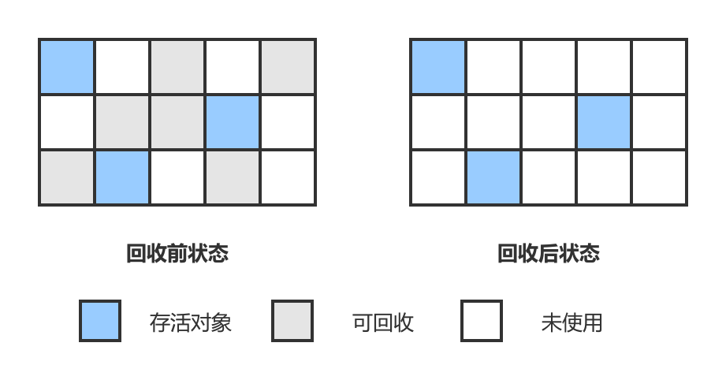
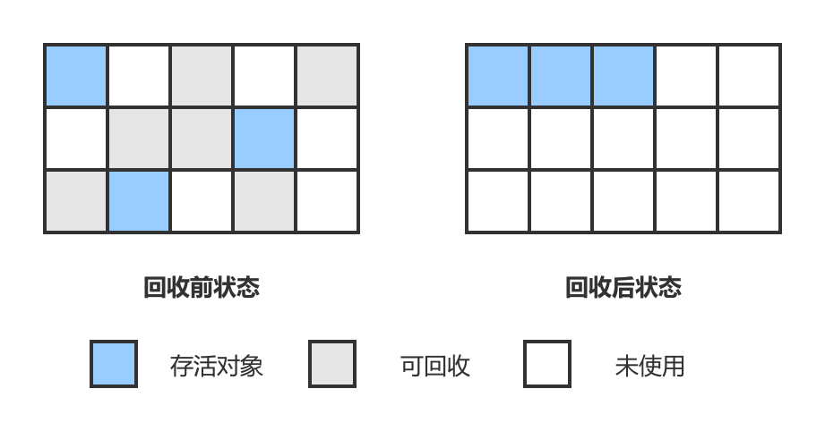
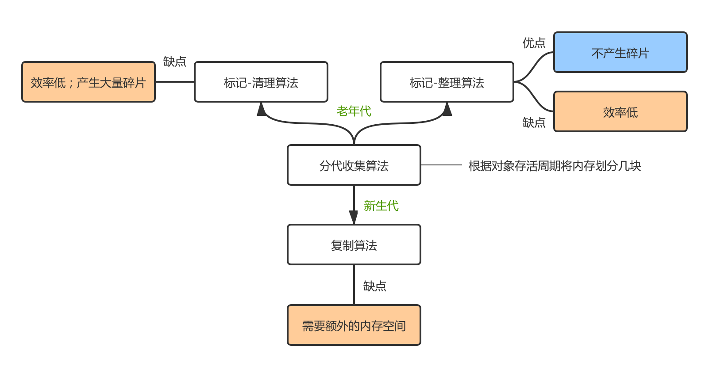
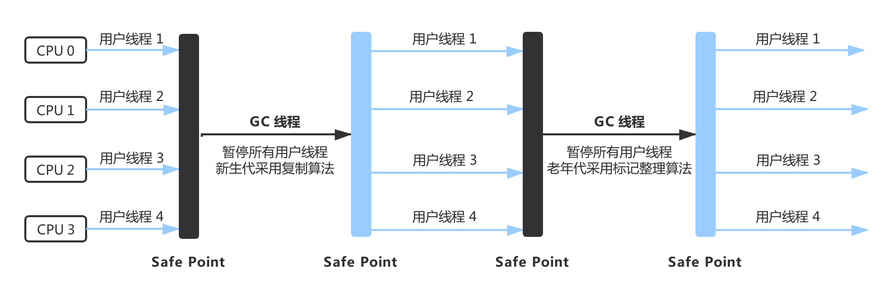

# 技术面试必备基础知识-Java-虚拟机

> 原文：[CS-Notes-Java-虚拟机](https://cyc2018.github.io/CS-Notes/#/notes/Java%20%E8%99%9A%E6%8B%9F%E6%9C%BA)

## 参考资料 
- [周志明. 深入理解 Java 虚拟机 [M]. 第二版. 机械工业出版社, 2013](https://book.douban.com/subject/24722612/)
- [归去来兮. HotSpot的安全区和安全点. cnblogs.com](https://www.cnblogs.com/mazhimazhi/p/11337660.html)

## JVM 运行时数据区域
- Java 虚拟机 (Java Virtual Machine, JVM) 在执行 Java 程序的过程中会把它所管理的内存划分为若干不同的数据区域。
- 这些区域各有用途，以及各自创建和销毁的时间。比如有的区域随着虚拟机进程的启动而存在，有些区域以来用户线程的启动而创建，结束而销毁。

	|  |
	| :-: |
	| 图 1-1 Java 虚拟机运行时数据区域 / JVM 内存模型 (来自 [CyC2018.CS-Notes](https://cyc2018.github.io/CS-Notes/#/notes/Java%20虚拟机?id=一、运行时数据区域) ) |

### 程序计数器
- 程序计数器：记录正在执行的虚拟机字节码指令的地址 (如果正在执行的是本地方法则为空)。

- Java 虚拟机的多线程是通过线程轮流切换并分配处理器执行时间的方式实现的，在任何时刻一个处理器 (多核心处理器是内核) 都只会执行一条线程中的指令。 

	为此，确保线程切换后能恢复正确的执行位置，每条线程都需要拥有一个独立的程序计数器。我们称这类内存区域为 `线程私有的内存`。

### Java 虚拟机栈
- Java 虚拟机栈：`线程私有的内存`。每个 Java 方法在执行的同时会创建一个 `栈帧` 用于存储 `局部变量表`、`操作数栈`、`常量池引用` 等信息。从方法调用直至执行完成的过程，对应着一个栈帧在 Java 虚拟机栈中入栈和出栈的过程。

	|  |
	| :-: |
	| 图 1-2 栈帧 |

- 该区域可能抛出以下异常：
	- 当线程请求的栈深度超过最大值，会抛出 StackOverflowError 异常；
	- 栈进行动态扩展时如果无法申请到足够内存，会抛出 OutOfMemoryError 异常。
- 可以通过 `-Xss` 这个虚拟机参数来指定每个线程的 Java 虚拟机栈内存大小，在 JDK 1.4 中默认为 256K，而在 JDK 1.5+ 默认为 1M：

	```shell
	java -Xss2M HackTheJava
	```

### 本地方法栈
- 本地方法栈与 Java 虚拟机栈类似，它们之间的区别只不过是本地方法栈为本地方法服务。
- 本地方法一般是用其它语言 (C、C++ 或汇编语言等) 编写的，并且被编译为基于本机硬件和操作系统的程序，对待这些方法需要特别处理。

### 堆
- `所有线程共享` 的内存区域，虚拟机启动是创建。
- `所有对象` 都在这里 `分配内存`，是垃圾收集的主要区域 (GC 堆，Garbage Collected Heap)。
- 现代的垃圾收集器基本都是采用 `分代收集算法`，其主要的思想是针对不同类型的对象采取不同的垃圾回收算法。可以将堆分成两块：
	- 新生代 (Young Generation)
	- 老年代 (Old Generation)
- 堆不需要连续内存 (不要求物理上连续的内存空间，逻辑连续即可)，并且可以动态增加其内存，增加失败会抛出 OutOfMemoryError 异常。

	可以通过 `-Xms` 和 `-Xmx` 这两个虚拟机参数来指定一个程序的堆内存大小，第一个参数设置初始值，第二个参数设置最大值。
	
	```shell
	java -Xms1M -Xmx2M HackTheJava
	```

### 方法区
- `所有线程共享` 的内存区域。
- 用于存放已被加载的 `类信息`、`常量`、`静态变量`、即时编译器编译后的 `代码` 等数据。
- 和堆一样不需要连续的内存，并且可以动态扩展，动态扩展失败一样会抛出 OutOfMemoryError 异常。
- 对这块区域进行垃圾回收的主要目标是对常量池的回收和对类的卸载，但是一般比较难实现。
- HotSpot 虚拟机把它当成 `永久代` 来进行垃圾回收。但很难确定永久代的大小，因为它受到很多因素影响，并且每次 Full GC 之后永久代的大小都会改变，所以经常会抛出 OutOfMemoryError 异常。

	> 为了更容易管理方法区，从 JDK 1.8 开始，移除永久代，并把方法区移至元空间，它位于本地内存中，而不是虚拟机内存中。

- 方法区是一个 JVM 规范，永久代与元空间都是其一种实现方式。在 JDK 1.8 之后，原来永久代的数据被分到了堆和元空间中。元空间存储类的元信息，静态变量和常量池等放入堆中。

### 运行时常量池
- 运行时常量池是方法区的一部分。
- Class 文件中的常量池 (编译器生成的字面量和符号引用) 会在类加载后被放入这个区域。
- 除了在编译期生成的常量，还允许动态生成，例如 String 类的 intern()。

	```java
	// String.intern() -- JDK 1.8
	if 判断这个常量是否存在于常量池 { // 存在
	    if 判断存在内容是引用还是常量 {
	        如果是引用，返回引用地址指向堆空间对象
	    } else {
	        如果是常量，直接返回常量池常量
	    }
	} else { // 不存在
	    将当前对象引用复制到常量池,并且返回的是当前对象的引用
	}
	```

### 直接内存
- 直接内存并不是虚拟机运行时数据区的一部分，也不是 JVM 规范中定义的内存区域。
- 在 JDK 1.4 中新引入了 `NIO` (New Input/Output) 类，它可以使用 Native 函数库直接分配堆外内存，然后通过一个存储在 Java 堆里的 DirectByteBuffer 对象作为这块内存的引用进行操作。这样能在一些场景中显著提高性能，因为避免了在堆内存和堆外内存来回拷贝数据。

## 垃圾收集算法与工具
- 垃圾收集 (Garbage Collection, GC) 主要是针对 `堆` 和 `方法区` 进行。
- 程序计数器、虚拟机栈和本地方法栈这三个区域属于线程私有的，只存在于线程的生命周期内，随线程结束就会消失，因此不需要对这三个区域进行垃圾回收。

### 对象存活判定算法
#### 引用计数算法
- 为对象添加一个引用计数器，当对象增加一个引用时计数器加 1，引用失效时计数器减 1。引用计数为 0 的对象可被回收。

- 在两个对象出现循环引用的情况下，此时引用计数器永远不为 0，导致无法对它们进行回收。正是因为循环引用的存在，因此 Java 虚拟机不使用引用计数算法。

	```java
	public class Test {

		public Object instance = null;

		public static void main(String[] args) {
			Test a = new Test();
			Test b = new Test();
			a.instance = b;
			b.instance = a;
			a = null;
			b = null;
			
			// 假设在此时发生 GC，a 和 b 能否被回收？
			System.gc();
		}
	}
	```
	
	答案是否定的。在上述代码中，a 与 b 引用的对象实例互相持有了对象的引用，因此当我们把对 a 对象与 b 对象的引用去除之后，由于两个对象还存在互相之间的引用，导致两个 Test 对象无法被回收。

#### 可达性分析算法
- 以 GC Roots 为起始点进行搜索，可达的对象都是存活的，不可达的对象可被回收。

	> 以图论角度解释，即没有一条路径可以让 GC Roots 达到这个对象。

	|  |
	| :-: |
	| 图 2-1 可达性分析算法判断对象是否可回收 |

- Java 虚拟机使用该算法来判断对象是否可被回收，GC Roots 一般包含以下内容：
  - 虚拟机栈中局部变量表 (栈帧的局部变量表)  中引用的对象。
  - 本地方法栈中 JNI 中引用的对象。
  - 方法区中类静态属性引用的对象。
  - 方法区中的常量引用的对象。

#### 方法区的回收
- 因为方法区主要存放永久代对象，而永久代对象的回收率比新生代低很多，所以在方法区上进行回收性价比不高。
- 主要是对常量池的回收和对类的卸载。

	> 为了避免内存溢出，在大量使用反射和动态代理的场景都需要虚拟机具备类卸载功能。

- 类的卸载条件很多，需要满足以下三个条件，并且满足了条件也不一定会被卸载：
	- 该类所有的实例都已经被回收，此时堆中不存在该类的任何实例。
	- 加载该类的 ClassLoader 已经被回收。
	- 该类对应的 Class 对象没有在任何地方被引用，也就无法在任何地方通过反射访问该类方法。

#### finalize()
- 类似 C++ 的析构函数，用于关闭外部资源。但是 try-finally 等方式可以做得更好，并且该方法运行代价很高，不确定性大，无法保证各个对象的调用顺序，因此最好不要使用。
- 当一个对象可被回收时，如果需要执行该对象的 finalize() 方法，那么就有可能在该方法中让对象重新被引用，从而实现自救。

	> 自救只能进行一次，若回收的对象之前调用了 finalize() 方法自救，后面回收时不会再调用该方法。

### 再谈引用类型
- 无论是通过引用计数算法判断对象的引用数量，还是通过可达性分析算法判断对象引用链是否可达，判定对象是否存活都与 `引用` 有关。
- 四种 `引用强度` 依次逐渐减弱：
	- 强引用：被强引用关联的对象不会被回收。
		
		```java
		// 使用 new 一个新对象的方式来创建强引用
		Object obj = new Object();
		```
		
	- 软引用：被软引用关联的对象只有在内存不够的情况下才会被回收。
	
		```java
		// 使用 SoftReference 类来创建软引用
		Object obj = new Object();
		SoftReference<Object> sf = new SoftReference<Object>(obj);
		obj = null;  // 使对象只被软引用关联
		```
	
	- 弱引用：被弱引用关联的对象一定会被回收，也就是说它只能存活到下一次垃圾回收发生之前。
	
		```java
		// 使用 WeakReference 类来创建弱引用
		Object obj = new Object();
		WeakReference<Object> wf = new WeakReference<Object>(obj);
		obj = null;
		```
		
	- 虚引用：又称为幽灵引用或者幻影引用，一个对象是否有虚引用的存在，不会对其生存时间造成影响，也无法通过虚引用得到一个对象。
	
		为一个对象设置虚引用的唯一目的是能在这个对象被回收时收到一个系统通知。
		
		```java
		// 使用 PhantomReference 来创建虚引用
		Object obj = new Object();
		PhantomReference<Object> pf = new PhantomReference<Object>(obj, null);
		obj = null;
		```

### 垃圾收集算法
#### 标记-清除算法
|  |
| :-: |
| 图 2-2 标记-清除算法示意 |

- 在标记阶段，程序会检查每个对象是否为活动对象，如果是活动对象，则程序会在对象头部打上标记。
- 在清除阶段，会进行对象回收并取消标志位。另外，还会判断回收后的分块与前一个空闲分块是否连续，若连续，会合并这两个分块。回收对象就是把对象作为分块，连接到被称为 `空闲链表` 的单向链表，之后进行分配时只需要遍历这个空闲链表，找到分块即可。
- 在分配时，程序会搜索空闲链表寻找空间大于等于新对象大小 size 的块 block。如果它找到的块等于 size，会直接返回这个分块；如果找到的块大于 size，会将块分割成大小为 size 与 (block - size) 的两部分，返回大小为 size 的分块，并把大小为 (block - size) 的块返回给空闲链表。
- 不足：
	- 标记和清除过程效率都不高；
	- 会产生大量不连续的内存碎片，导致无法给大对象分配内存。
	
#### 标记-整理算法
|  |
| :-: |
| 图 2-3 标记-整理算法 |

- 让所有存活的对象都向一端移动，然后直接清理掉端边界以外的内存。
- 优点:不会产生内存碎片。
- 不足:需要移动大量对象，处理效率比较低。

#### 复制算法
|  |
| :-: |
| 图 2-4 复制算法 |

- 将内存划分为大小相等的两块，每次只使用其中一块，当这一块内存用完了就将还存活的对象复制到另一块上面，然后再把使用过的内存空间进行一次清理。
- 不足：只使用了内存的一半。
- 现在的商业虚拟机都采用这种收集算法回收新生代，但是并不是划分为大小相等的两块，而是一块较大的 Eden 空间和两块较小的 Survivor 空间，每次使用 Eden 和其中一块 Survivor。在回收时，将 Eden 和 Survivor 中还存活着的对象全部复制到另一块 Survivor 上，最后清理 Eden 和使用过的那一块 Survivor。
	
	HotSpot 虚拟机的 Eden 和 Survivor 大小比例默认为 8:1，保证了内存的利用率达到 90%。我们没有办法保证每次回收都只有不多于 10% 的对象存活，那么一块 Survivor 就不够用了，此时需要依赖于老年代进行空间分配担保，也就是借用老年代的空间存储放不下的对象。

#### 分代收集算法
|  |
| :-: |
| 图 2-5 分代收集算法 |

- 现在的商业虚拟机采用分代收集算法，它根据对象存活周期将内存划分为几块，不同块采用适当的收集算法。

- 一般将堆分为新生代和老年代：
	- 新生代中对象存活率低，使用 `复制算法`。
	- 老年代中对象存活率高、没有额外空间对它进行分配担保，使用 `标记-清除` 算法或者 `标记-整理` 算法。

### HotSpot 算法实现
#### 根节点枚举
- 使用可达性分析算法，从一系列 GCRoot 对象开始，向下搜索引用链，若一个对象没有与任何 GCRoot 对象关联，这个对象就会被判定为可回收对象。

	这一过程称为 `根节点枚举`，也就是垃圾回收中的 `标记过程`。当前所有的垃圾收集器，在标记阶段都必须停止所有 Java 执行线程 (Stop the wrold, STW)，以保证对象引用状态不会发生变化。

- HotSpot 虚拟机使用的是准确式 GC，当执行系统停顿下来后，并不需要一个不漏地检查完所有执行上下文和全局的引用位置，而是维护了一个专门的映射表 `OopMap` 记录哪些地方存放着对象引用，来快速完成根节点枚举过程。

	在类加载完成时，HotSpot 就会把对象内某个偏移位置是否为对象引用记录下来，JIT 编译过程中，也会在特定的位置记录下栈和局部变量表中哪些位置是引用。

#### 安全点 SafePoint
- 在 OopMap 协助下，HotSpot 可快速且准确地完成 GC Roots 枚举。但是 OopMap 内容变化的指令非常多，如果为每一条指令都生成对应的 OopMap，那么将需要大量的额外空间。为每一个操作记录 OopMap 不现实，为此 HotSpot 虚拟机引入了安全点 (SafePoint) 的概念。

- SafePoint 是程序中的某些位置，线程执行到这些位置时，线程中的某些状态是确定的，在 SafePoint 可以记录 OopMap 信息，线程在 SafePoint 停顿，虚拟机进行 GC。

- 对于一个线程来说，可以处于 SafePoint 上，也可以不处 SafePoint 上。一个线程在 SafePoint 时，它的状态可以安全地被其他 JVM 线程所操作和观测。

- SafePoint 如何在 GC 发生时让所有线程 (不包括执行 JNI 调用的线程) 能执行在最近的安全点上停顿下来，这里有两种方案可供选择：
	- 抢先式中断 (Preemptive Suspension)：JVM 需要GC时，中断所有线程，让没有到达 SafePoint 的线程继续执行至 SafePoint 并中断。
	- 主动式中断 (Voluntary Suspension)：在内存中设置标志位，各线程执行时主动式去轮询这个标志，发现中断标志为真时就自己中断挂起。

#### 安全区 SafeRegion
- SafePoint 无法解决线程未达到 SafePoint 并处于休眠或等待状态的情况，此时引入安全区域 (SafeRegion) 的概念。
- SafeRegion 是代码中的一块区域或线程的状态。在 SafeRegion 中，线程执行与否不会影响对象引用的状态。线程进入 SafeRegion 会给自己加标记，告诉虚拟机可以进行GC；线程准备离开 SafeRegion 前会询问虚拟机 GC 是否完成。

### 垃圾收集器
> 以下垃圾收集器是基于 JDK 1.7 展开介绍的。

|  |
| :-: |
| 图 2-6 HotSpot 虚拟机的垃圾收集器 |

- 若 `垃圾收集算法` 是内存回收的 `方法论`，则 `垃圾收集器` 就是内存回收的 `具体实现`。
- 图 2-6 展示了 HotSpot 虚拟机中的 7 个垃圾收集器，连线表示垃圾收集器可以 `配合使用`。

	> `配合使用`：指的是在限定的使用场景，新生代和老年代各有垃圾收集器专职负责工作。

- 开始讨论垃圾收集器的语境中，我们需要了解一些名词概念：
	- 单线程与多线程：单线程指的是垃圾收集器只使用一个线程，而多线程使用多个线程。
	- 串行 (Serial)：指垃圾收集器与用户程序交替执行，这意味着在执行垃圾收集的时候需要停顿用户程序。
	- 并行 (Parallel)：指多条垃圾收集线程并行工作，但此时用户线程仍处于等待状态。
	- 并发 (Concurrent)：指的是垃圾收集器和用户程序同时执行，用户程序继续运行，垃圾收集器运行于另一个 CPU 上。但不一定是并行，可能交替执行。

		> 除了 CMS 和 G1 之外，其它垃圾收集器都是以串行的方式执行。

#### Serial 收集器
|  |
| :-: |
| 图 2-7 Serial / Serial Old 收集器运行示意图 |

- Serial 翻译为串行，也就是说它以串行的方式执行。
- 它是 `单线程` 的收集器，只会使用一个线程进行垃圾收集工作。
- 它是 `Client` 场景下的默认 `新生代收集器`，因为在该场景下内存一般来说不会很大。它收集一两百兆垃圾的停顿时间可以控制在一百多毫秒以内，只要不是太频繁，这点停顿时间是可以接受的。
- 优点：是简单高效，在单个 CPU 环境下，由于没有线程交互的开销，因此拥有最高的单线程收集效率。

#### ParNew 收集器
|  |
| :-: |
| 图 2-8 ParNew / Serial Old 收集器运行示意图 |

- 它是 Serial 收集器的 `多线程` 版本。
- 它是 `Server` 场景下默认的 `新生代收集器`，除了性能原因外 (Serial 收集器)，它还能与 CMS 收集器配合使用。

#### Parallel Scavenge 收集器
|  |
| :-: |
| 图 2-9 Parallel Scavenge / Parallel Old 收集器运行示意图 |

- 与 ParNew 一样是 `多线程` 收集器。

- 其它收集器目标是尽可能缩短垃圾收集时用户线程的停顿时间，而它的目标是达到一个可控制的吞吐量，因此它被称为 `吞吐量优先` 收集器。

	> 吞吐量 = 运行用户代码的时间 / (运行用户代码时间 + 垃圾收集时间)，即 CPU 用于运行用户代码的时间与 CPU 总消耗时间的比值。

- 停顿时间越短就越适合需要与用户交互的程序，良好的响应速度能提升用户体验。而高吞吐量则可以高效率地利用 CPU 时间，尽快完成程序的运算任务，适合在后台运算而不需要太多交互的任务。

	缩短停顿时间是以牺牲吞吐量和新生代空间来换取的：新生代空间变小，垃圾回收变得频繁，导致吞吐量下降。

- 可以通过一个开关参数打开 GC 自适应的调节策略 (GC Ergonomics)，就不需要手工指定新生代的大小 (-Xmn)、Eden 和 Survivor 区的比例、晋升老年代对象年龄等细节参数了。虚拟机会根据当前系统的运行情况收集性能监控信息，动态调整这些参数以提供最合适的停顿时间或者最大的吞吐量。

#### Serial Old 收集器
- 是 Serial 收集器的 `老年代版本`，也是给 `Client` 场景下的虚拟机使用。如果用在 Server 场景下，它有两大用途：
	- 在 JDK 1.5 以及之前版本 (Parallel Old 诞生以前) 与 Parallel Scavenge 收集器搭配使用。
	- 作为 CMS 收集器的后备预案，在并发收集发生 Concurrent Mode Failure 时使用。

#### Parallel Old 收集器
- 是 Parallel Scavenge 收集器的 `老年代版本`。
- 在注重吞吐量以及 CPU 资源敏感的场合，都可以优先考虑 Parallel Scavenge 加 Parallel Old 收集器。

#### CMS 收集器
|  |
| :-: |
| 图 2-10 CMS 收集器运行示意图 |

- CMS (Concurrent Mark Sweep)，`Mark Sweep` 指的是 `标记-清除` 算法。
- CMS 运作过程可分为以下四个流程：
	- `初始标记`：仅是标记一下 GC Roots 能直接关联到的对象，速度很快，需要停顿。
	- `并发标记`：进行 GC Roots Tracing 的过程，它在整个回收过程中耗时最长，不需要停顿。
	- `重新标记`：为了修正并发标记期间因用户程序继续运作而导致标记产生变动的那一部分对象的标记记录，需要停顿。
	- `并发清除`：不需要停顿。
	
		> 在整个过程中耗时最长的并发标记和并发清除过程中，收集器线程都可以与用户线程一起工作，不需要进行停顿。

- 缺点：
	- 吞吐量低：低停顿时间是以牺牲吞吐量为代价的，导致 CPU 利用率不够高。
	- 无法处理浮动垃圾，可能出现 Concurrent Mode Failure。失败导致另一次 Full GC 的产生。

		> 浮动垃圾是指并发清除阶段由于用户线程继续运行而产生的垃圾，这部分垃圾只能到下一次 GC 时才能进行回收。由于浮动垃圾的存在，因此需要预留出一部分内存，意味着 CMS 收集不能像其它收集器那样等待老年代快满的时候再回收。如果预留的内存不够存放浮动垃圾，就会出现 Concurrent Mode Failure，这时虚拟机将临时启用 Serial Old 来替代 CMS。

	- 标记-清除算法导致的空间碎片，往往出现老年代空间剩余，但无法找到足够大连续空间来分配当前对象，不得不提前触发一次 Full GC。

#### G1 收集器
|  |
| :-: |
| 图 2-11 G1 收集器运行示意图 |

- G1 (Garbage-First)，它是一款面向服务端应用的垃圾收集器，在多 CPU 和大内存的场景下有很好的性能。HotSpot 开发团队赋予它的使命是未来可以替换掉 CMS 收集器。

- G1 把堆划分成多个大小相等的 `独立区域` (Region)，继续保留新生代和老年代的概念，但新生代和老年代不再 `物理隔离`。
	- 通过引入 Region 的概念，从而将原来的一整块内存空间划分成多个的小空间，使得每个小空间可以单独进行垃圾回收。
	- 这种划分方法带来了很大的灵活性，使得 `可预测的停顿时间模型` 成为可能。通过记录每个 Region 垃圾回收时间以及回收所获得的空间 (这两个值是通过过去回收的经验获得)，并维护一个 `优先列表`，每次根据允许的收集时间，优先 `回收价值最大` 的 Region。
	
		> Tips：Garbage-First 名称的由来。
	
	- 每个 Region 都有一个 Remembered Set，用来记录该 Region 对象的引用对象所在的 Region。通过使用 Remembered Set，在做 `可达性分析` 的时候就可以 `避免全堆扫描`。
	
- 如果不计算维护 Remembered Set 的操作，G1 收集器的运作大致可划分为以下几个步骤：
	- `初始标记`：仅是标记一下 GC Roots 能直接关联到的对象，速度很快，需要停顿。
	- `并发标记`：从 GC Root 开始对堆中对象进行 `可达性分析`，找出存活对象，该阶段耗时较长，但可与用户程序并发执行，不需要停顿。
	- `最终标记`：为了修正在并发标记期间因用户程序继续运作而导致标记产生变动的那一部分标记记录，虚拟机将这段时间对象变化记录在线程的 Remembered Set Logs 里面，最终标记阶段需要把 Remembered Set Logs 的数据合并到 Remembered Set 中。这阶段需要停顿线程，但是可并行执行。
	- `筛选回收`：首先对各个 Region 中的 `回收价值和成本进行排序`，根据用户所期望的 GC 停顿时间来制定回收计划。此阶段其实也可以做到与用户程序一起并发执行，但是因为只回收一部分 Region，时间是用户可控制的，而且停顿用户线程将大幅度提高收集效率。
	
- 具备如下特点：
	- `分代收集`：堆被分为新生代和老年代，其它收集器进行收集的范围都是整个新生代或者老年代。而 G1 可以不依赖其他收集器，直接对新生代和老年代一起回收。
	- `空间整合`：整体来看是基于 `标记-整理算法` 实现的收集器，从局部 (两个 Region 之间) 上来看是基于 `复制算法` 实现的，这意味着运行期间不会产生内存空间碎片。
	- `可预测的停顿`：能让使用者明确指定在一个长度为 M 毫秒的时间片段内，消耗在 GC 上的时间不得超过 N 毫秒。

#### 垃圾收集器总结
- 综上所述，7 种垃圾收集器大致的细节差异，如表 2-1 所示：

	| 收集器 | 架构模式 | 分代收集 | 运行方式 | 线程环境 | 适用场景 |
	| :---: | :---: | :---: | :---: | :---: | :--- |
	| Serial | Client | 新生代 | 串行 | 单线程 | -- |
	| ParNew | Server | 新生代 | 并行 | 多线程 | -- |
	| Parallel Scavenge | -- | 新生代 | 并行 | 多线程 | 吞吐量优先<br>CPU 资源敏感场合  |
	| Serial Old | Client | 老年代 | 串行 | 单线程 | -- |
	| Parallel Old | -- | 老年代 | 并行 | 多线程 | 吞吐量优先<br>CPU 资源敏感场合 |
	| CMS | Server | 老年代 | 并发 | 多线程 | 并发收集、低停顿；<br>会产生内存空间碎片 |
	| G1 | Server | 新 / 老 | 并发 | 多线程 | 并发收集、低停顿；<br>不产生内存空间碎片 |

## 内存分配与回收策略
### 内存分配策略
#### Minor GC 和 Full GC
- `Minor GC`：回收 `新生代`，因为新生代对象存活时间很短，因此 Minor GC 会频繁执行，执行的速度也比较快。
- `Full GC`：回收 `老年代` 和 `新生代`，老年代对象其存活时间长，因此 Full GC 很少执行，执行速度会比 Minor GC 慢很多。

#### 对象优先在 Eden 分配
- 大多数情况下，对象在新生代 Eden 上分配，当 Eden 空间不够时，发起 Minor GC。

#### 大对象直接进入老年代
- 大对象是指需要连续内存空间的对象，最典型的大对象是那种很长的字符串以及数组。
- 经常出现大对象会提前触发垃圾收集以获取足够的连续空间分配给大对象。
- `-XX:PretenureSizeThreshold`：大于 此值的对象直接在老年代分配，避免在 Eden 和 Survivor 之间的大量内存复制。

#### 长期存活对象进入老年代
- 为对象定义年龄计数器，对象在 Eden 出生并经过 Minor GC 依然存活，将移动到 Survivor 中，年龄就增加 1 岁，增加到一定年龄则移动到老年代中。
- `-XX:MaxTenuringThreshold`：用来定义年龄的阈值。

#### 动态对象年龄判定
- 虚拟机并不是永远要求对象的年龄必须达到 MaxTenuringThreshold 才能晋升老年代，如果在 Survivor 中相同年龄所有对象大小的总和大于 Survivor 空间的一半，则年龄大于或等于该年龄的对象可以直接进入老年代，无需等到 MaxTenuringThreshold 中要求的年龄。

#### 空间分配担保
- 在发生 Minor GC 之前，虚拟机先检查老年代最大可用的连续空间是否大于新生代所有对象总空间，如果条件成立的话，那么 Minor GC 可以确认是安全的。
- 如果不成立的话虚拟机会查看 HandlePromotionFailure 的值是否允许担保失败，若允许那么就会继续检查老年代最大可用的连续空间是否大于历次晋升到老年代对象的平均大小。
	- 如果大于，将尝试着进行一次 Minor GC；
	- 如果小于，或者 HandlePromotionFailure 的值不允许冒险，那么就要进行一次 Full GC。

### 内存回收策略
- `System.gc()`：调用 System.gc() 只是 `建议` 虚拟机执行 Full GC，但虚拟机不一定真正去执行。

	> 不建议使用这种方式，而是让虚拟机管理内存。

- `老年代空间不足`：
	- 老年代空间不足的常见场景为前文所讲的大对象直接进入老年代、长期存活的对象进入老年代等。
	- 为了避免以上原因引起的 Full GC，应当尽量不要创建过大的对象以及数组。
	- 除此之外，可以通过 `-Xmn` 虚拟机参数调大新生代的大小，让对象尽量在新生代被回收掉，不进入老年代。
	- 还可以通过` -XX:MaxTenuringThreshold` 调大对象进入老年代的年龄，让对象在新生代多存活一段时间。
- `空间分配担保失败`：使用复制算法的 Minor GC 需要老年代的内存空间作担保，如果担保失败会执行一次 Full GC。具体内容请参考上面 [空间分配担保](#空间分配担保)。
- `永久代空间不足`：
	- 在 `JDK 1.7` 及以前，HotSpot 虚拟机中的方法区是用永久代实现的，永久代中存放的为一些 Class 的信息、常量、静态变量等数据。
	- 当系统中要加载的类、反射的类和调用的方法较多时，永久代可能会被占满，在未配置为采用 CMS GC 的情况下也会执行 Full GC。如果经过 Full GC 仍然回收不了，那么虚拟机会抛出 java.lang.OutOfMemoryError。
	- 为避免以上原因引起的 Full GC，可采用的方法为增大永久代空间或转为使用 CMS GC。
- `Concurrent Mode Failure`：执行 CMS GC 的过程中同时有对象要放入老年代，而此时老年代空间不足（可能是 GC 过程中浮动垃圾过多导致暂时性的空间不足），便会报 Concurrent Mode Failure 错误，并触发 Full GC。

## 虚拟机类加载机制

