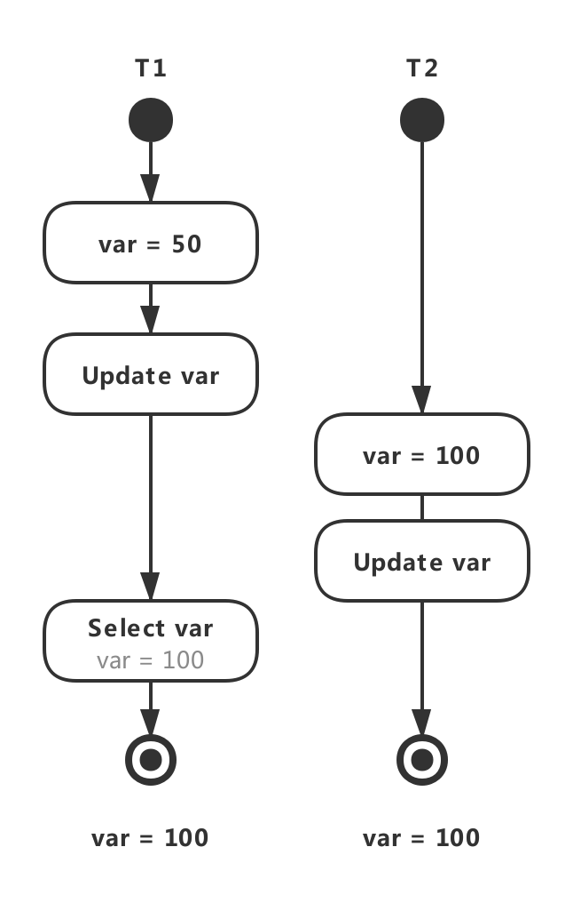
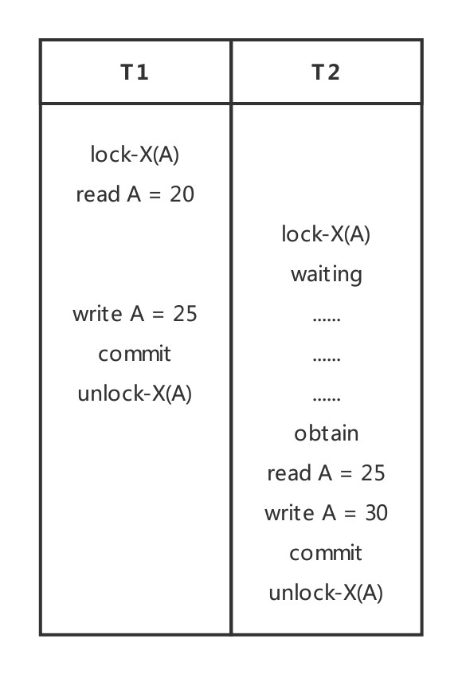
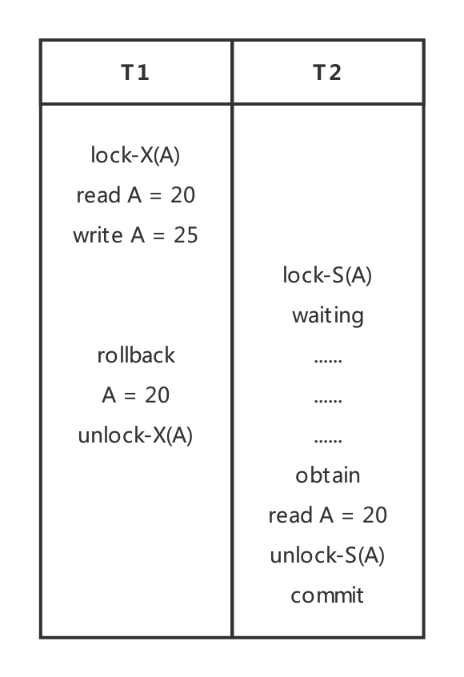

# 4技术面试必备基础知识-CyC2018

> 在线阅读：[CS-Notes](https://cyc2018.github.io/CS-Notes/#/README)

## 数据库

### 数据库系统原理 
#### 事务
- 概念：事务指的是满足 `ACID` 特性的一组操作，可以通过 Commit 提交一个事务，也可以使用 Rollback 进行回滚。
- ACID：
	- 原子性 (Atomicity)：
		- 事务被视为不可分割的最小单元，事务的所有操作要么全部提交成功，要么全部失败回滚。
		- 回滚可以用回滚日志来实现，回滚日志记录着事务所执行的修改操作，在回滚时反向执行这些修改操作即可。
	- 一致性 (Consistency)：数据库在事务执行前后都保持一致性状态。在一致性状态下，所有事务对一个数据的读取结果都是相同的。
	- 隔离性 (Isolation)：一个事务所做的修改在最终提交以前，对其它事务是不可见的。
	- 持久性 (Durability)：一旦事务提交，则其所做的修改将会永远保存到数据库中。即使系统发生崩溃，事务执行的结果也不能丢失。
	
		> 使用重做日志来保证持久性。

- 事务的 ACID 特性概念简单，但不是很好理解，主要是因为这几个特性不是一种平级关系：
	- 只有满足一致性，事务的执行结果才是正确的。
		- 在无并发的情况下，事务串行执行，隔离性一定能够满足。此时只要能满足原子性，就一定能满足一致性。
		- 在并发的情况下，多个事务并行执行，事务不仅要满足原子性，还需要满足隔离性，才能满足一致性。
	- 事务满足持久化是为了能应对数据库崩溃的情况。  

		|  |
		| :---: |
		| 图 1-1 ACID逻辑关系 |

- AUTOCOMMIT：MySQL 默认采用自动提交模式。也就是说，如果不显式使用START TRANSACTION 语句来开始一个事务，那么每个查询都会被当做一个事务自动提交。

#### 并发一致性问题
##### 丢失数据
`丢失数据`：$T_1$ 和 $T_2$ 两个事务都对一个数据进行修改，$T_1$ 先修改，$T_2$ 随后修改，$T_2$ 的修改覆盖了 $T_1$ 的修改。如图 1-2 所示。 

> 简记为 `同时修改`。

##### 读脏数据
`读脏数据`：$T_1$ 对一个数据做了修改，$T_2$ 读取这一个数据。若 $T_1$ 执行 ROLLBACK 操作，则 $T_2$ 读取的结果和第一次的结果不一样。如图 1-3 所示。

> 简记为 `同时读`。

##### 不可重复读
`不可重复读`：$T_2$ 读取一个数据，$T_1$ 对该数据做了修改。如果 $T_2$ 再次读取这个数据，此时读取的结果和第一次读取的结果不同。如图 1-4 所示。

> 简记为 `修改时读`。

##### 幻影读
`幻影读`：$T_1$ 读取某个范围的数据，$T_2$ 在这个范围内插入新的数据，$T_1$ 再次读取这个范围的数据，此时读取的结果和和第一次读取的结果不同。如图 1-5 所示。

> 简记为 `读时修改`。

|  |  |
| :---: | :---: |
| 图 1-2 丢失数据 | 图 1-3 读脏数据 |
|  |  |
| 图 1-4 不可重复读 | 图 1-5 幻影读 |

##### 解决方案
- 在并发环境下，事务的隔离性很难保证，因此会出现很多并发一致性问题。
- 产生并发不一致性问题的主要原因是破坏了事务的隔离性。
- 解决方法是通过 `并发控制` 来保证隔离性。
	- 并发控制可以通过 `封锁` 来实现，但是封锁操作需要用户自己控制，相当复杂。
	- 数据库管理系统提供了事务的 `隔离级别`，让用户以一种更轻松的方式处理并发一致性问题。

#### 封锁
##### 封锁粒度
- MySQL 中提供了两种封锁粒度：`行级锁` 以及 `表级锁`。
- 应尽量只锁定需要修改的那部分数据，而不是所有的资源。锁定的数据量越少，发生锁争用的可能就越小，系统的并发程度就越高。
- 但是加锁需要消耗资源，锁的各种操作（包括获取锁、释放锁、以及检查锁状态）都会增加系统开销。因此封锁粒度越小，系统开销就越大。

	> 为此，我们在选择封锁粒度时，需在 `锁开销` 和 `并发程度` 之间做一个 `权衡`。

##### 封锁类型
###### 读写锁
- 排它锁 (Exclusive)，简写为 `X 锁`，又称 `写锁`。
- 共享锁 (Shared)，简写为 `S 锁`，又称 `读锁`。

- 有以下两个规定：
	- 一个事务对数据对象 A 加了 X 锁，就可以对 A 进行读取和更新。加锁期间其它事务不能对 A 加任何锁。
	- 一个事务对数据对象 A 加了 S 锁，可以对 A 进行读取操作，但是不能进行更新操作。加锁期间其它事务能对 A 加 S 锁，但是不能加 X 锁。
- 锁的兼容关系如表 1-1 所示 :  读写锁之间的兼容关系 

	|  | 排它锁 X | 共享锁 S |
	| :---: | :---: | :---: |
	| 排它锁 X | ✖️ | ✖️ |
	| 共享锁 S | ✖️ | ✔️ |
	
	图例说明：✖️ 相互不兼容	✔️ 相互兼容

###### 意向锁
- 使用意向锁 (Intention Locks)，可以更容易地支持多粒度封锁，使得行锁和表锁能够共存。
- 在存在行级锁和表级锁的情况下，事务 T 想要对表 A 加 X 锁，就需要先检测是否有其它事务对表 A 或者表 A 中的任意一行加了锁，那么就需要对表 A 的每一行都检测一次，这是非常耗时的。

	意向锁在原来的 X/S 锁之上引入了 IX / IS，IX / IS 都是 `表级别的锁`，用来表示一个事务稍后会对表中的某个数据行上加 X 锁或 S 锁。整理可得以下两个规定：
	
	- 一个事务在获得某个数据行对象的 S 锁之前，必须先获得表的 IS 锁或者更强的锁；
	- 一个事务在获得某个数据行对象的 X 锁之前，必须先获得表的 IX 锁。

- 各种锁的兼容关系如表 1-2 所示：读写锁与意向锁的兼容关系
	- 任意 IS / IX 锁之间都是兼容的，因为它们只是表示想要 `对表加锁`，而不是真正加锁；
	- S 锁只与 S 锁和 IS 锁兼容，也就是说事务 T 想要对数据行加 S 锁，其它事务可以已经获得对表或者表中的行的 S 锁。

	|      |排它锁  X | 意向排它锁 IX| 共享锁 S |意向共享锁  IS |
	| :---: | :---: | :---: | :---: | :---: |
	| 排它锁 X | ✖️ | ✖️ | ✖️ | ✖️ |
	| 意向排它锁 IX | ✖️ | ✔️ | ✖️ | ✔️|
	|共享锁  S | ✖️ | ✖️ | ✔️ | ✔️ |
	|意向共享锁  IS | ✖️ | ✔️ | ✔️ | ✔️ |
	
	图例说明：✖️ 相互不兼容	✔️ 相互兼容
	
##### 封锁协议
###### 三级封锁协议
- `一级封锁协议`：事务 T 要修改数据 A 时必须加 X 锁，直到 T 结束才释放锁。`防止同时修改`

	> 可解决 `丢失修改` 问题，因不能同时有两个事务对同一个数据进行修改，那么事务的修改就不会被覆盖。

- `二级封锁协议`：在一级的基础上，要求读取数据 A 时必须加 S 锁，读取完马上释放 S 锁。`防止修改时读取`

	> 可解决 `丢失修改` 和 `读脏数据` 问题，因为一个事务在对数据 A 进行修改，根据 1 级封锁协议，会加 X 锁，那么就不能再加 S 锁了，也就是不会读入数据。
	
- `三级封锁协议`：在二级的基础上，要求读取数据 A 时必须加 S 锁，直到事务结束了才能释放 S 锁。`防止读取时修改`

	> 可解决 `丢失修改` 和 `读脏数据` 问题，还进一步防止了 `不可重复读` 的问题，因为读 A 时，其它事务不能对 A 加 X 锁，从而避免了在读的期间数据发生改变。
	
	| | | |
	| :---: | :---: | :---: |
	| 图 1-6 一级封锁协议示例 | 图 1-7 二级封锁协议示例 | 图 1-8 三级封锁协议示例 |

###### 两段锁协议
- 加锁和解锁分为两个阶段进行。
- 可串行化调度：通过并发控制，使得并发执行的事务结果与某个串行执行的事务结果相同。
	- 事务遵循两段锁协议是保证可串行化调度的 `充分条件`。例如以下操作满足两段锁协议，它是可串行化调度。

		```html
		lock-x(A)...lock-s(B)...lock-s(C)...unlock(A)...unlock(C)...unlock(B)
		```

	- 但不是 `必要条件`，例如以下操作不满足两段锁协议，但是它还是可串行化调度。

		```html
		lock-x(A)...unlock(A)...lock-s(B)...unlock(B)...lock-s(C)...unlock(C)
		```

##### MySQL 隐式与显示锁定
- MySQL 的 InnoDB 存储引擎采用两段锁协议，会根据 `隔离级别` 在需要的时候 `自动加锁`，并且所有的锁都是在同一时刻（commit 或者 rollback）被释放，这被称为 `隐式锁定`。
- InnoDB 也可以使用特定的语句进行 `显式锁定`：

	```sql
	SELECT ... LOCK In SHARE MODE;
	SELECT ... FOR UPDATE;
	```

#### 隔离级别
- 概念：事务指定一个隔离级别，该隔离级别定义一个事务必须与由其他事务进行的资源或数据更改相隔离的程度。

	隔离级别是从允许并发副作用发生的角度进行描述的。例如，脏读、不可重复读或幻影读。如表 1-3 所示，是关于隔离级别与并发副作用的层级关系图。

	| 隔离级别 | 脏读 | 不可重复读 | 幻影读 |
	| :----: | :----: | :----: | :----: |
	| 未提交读 |  ✔️  |  ✔️  |  ✔️  |
	| 提交读   |  ✖️  |  ✔️  |  ✔️  |
	| 可重复读 |  ✖️  |  ✖️  |  ✔️  |
	| 可串行化 |  ✖️  |  ✖️  |  ✖️  |
  
	图例说明：✖️ 是可避免的情况	✔️ 是允许发生的情况

##### 未提交读
- 未提交读 (Read uncommitted)：事务中的修改，即使没有提交，对其它事务也是可见的。

##### 提交读
- 提交读 (Read committed)：一个事务只能读取已经提交的事务所做的修改。换句话说，一个事务所做的修改在提交之前对其它事务是不可见的。

##### 可重复读
- 可重复读 (Repeatable Read)：保证在同一个事务中多次读取同样数据的结果是一样的。

##### 可串行化
- 可串行化 (Serialzable)：强制事务串行执行。需要加锁实现，而其它隔离级别通常不需要。

#### 多版本并发控制
- 多版本并发控制 (Multi-Version Concurrency Control, MVCC) 是 MySQL 的 InnoDB 存储引擎实现隔离级别的一种具体方式，用于实现 `提交读` 和 `可重复读` 这两种隔离级别。
- 而 `未提交读` 隔离级别总是读取最新的数据行，无需使用 MVCC。
- `可串行化` 隔离级别需要对所有读取的行都加锁，单纯使用 MVCC 无法实现。

##### 版本号
- 系统版本号：是一个递增的数字，每开始一个新的事务，系统版本号就会自动递增。
- 事务版本号：事务开始时的系统版本号。

##### 隐藏列
- MVCC 在每行记录后面都保存着两个隐藏的列，用来存储两个版本号：
	- 创建版本号：指示创建一个数据行的快照时的系统版本号；
	- 删除版本号：如果该快照的删除版本号大于当前事务版本号表示该快照有效，否则表示该快照已经被删除了。

##### Undo 日志
- MVCC 使用到的快照存储在 Undo 日志中，该日志通过回滚指针把一个数据行（Record）的所有快照连接起来。

##### 实现过程
> 以下实现过程针对可重复读隔离级别。

- 当开始一个事务时，该事务的版本号肯定大于当前所有数据行快照的创建版本号，理解这一点很关键。
- 数据行快照的创建版本号是创建数据行快照时的系统版本号，系统版本号随着创建事务而递增，因此新创建一个事务时，这个事务的系统版本号比之前的系统版本号都大，也就是比所有数据行快照的创建版本号都大。

##### 快照读与当前读

#### Next-Key Locks
- Next-Key Locks 是 MySQL 的 InnoDB 存储引擎的一种锁实现。
- MVCC 不能解决 `幻影读` 问题，Next-Key Locks 就是为了解决这个问题而存在的。
- 在可重复读 (REPEATABLE READ) 隔离级别下，使用 MVCC + Next-Key Locks 可以解决幻读问题。

#### 关系数据库设计理论

#### E-R 图