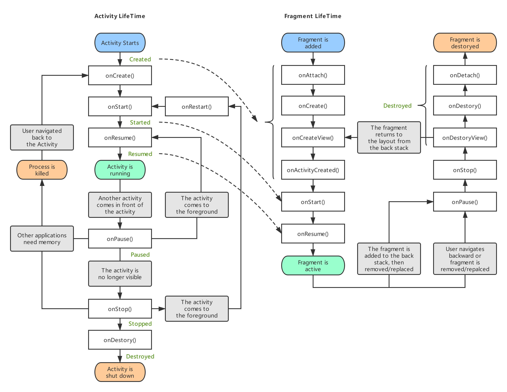

# 技术面试必备基础知识-Android

## Android 生命周期
### Activity 的生命周期

|  |
| :-: |
| 图 1-1 Activity 的完整生命周期 |

- 在系统中，触发 Activity 生命周期改变的方式：
	- 有用户参与的生命周期改变；
	- 系统回收或者配置修改导致的生命周期改变；
	
- 在 Activity 生命周期中，主要包含 6 种状态：
	- 6 种状态：onCreate()、onStart()、onResume()、onPause()、onStop()、onDestroy()。
	
		```java
		public class Activity extends ApplicationContext {
			protected void onCreate(Bundle savedInstanceState);
			protected void onStart();
			protected void onResume();
			protected void onPause();
			protected void onStop();
			protected void onDestory();
		}
		```
	
	- 6 种状态之间两两配对、有始有终，构成三组生命周期：完整的生命周期 (Entire Lifetime)、可视的生命周期 (Visible Lifetime) 以及前台的生命周期 (Foreground Lifetime)。
	
		- 完整的生命周期：表示 Activity 组件从创建到销毁的全部过程，是最外层的生命周期。生命周期发生在调用 `onCreate()` 与调用 `onDestory()` 之间。
		
			> 注意：不能保证 onDestory() 被调用的时机。例如，Activity 在 Activity 栈中，当系统内存不足时则可能触发调用 onDestory() 方法强制销毁 Activity。
	
		- 可视的生命周期：表示 Activity 组件 (当前屏幕看到的 Activity) 从用户可视到离开用户视线的全过程。生命周期发生在调用 `onStart()` 与调用 `onStop()` 之间。
		- 前台的生命周期：表示 Activity 组件显示于其他 Activity 组件前，即位于 Activity 任务栈的栈顶，拥有最高优先级的资源使用权。生命周期发生在调用 `OnResume()` 与调用 `onPause()` 之间。

			> 在可视的生命周期中，Activity 组件可能位于 `全透明` 或者 `部分透明` 的 Acticity 下。前台状态必须位于全部的 Activity 之上。

	- onRestart()、onRestoreInstanceState() 和 onSaveInstanceState()：
		- onRestart()：当页面从 Activity 栈内调至栈顶时，会调用此方法，初次创建时不会调用。
		- onSaveInstanceState()：用于储存 Activity 的状态信息。
		- onRestoreInstanceState()：用于恢复 Activity 的状态信息。
	
			> 仅用于系统导致的页面重建，而用户导致的页面重建需在 onCreate() 中由开发者自主恢复状态信息。

### Service 的生命周期

|  |
| :-: |
| 图 1-2 Service 的完整生命周期 |

### Fragment 的生命周期

|  |
| :-: |
| 图 1-3 Fragment 的完整生命周期 |

- Fragment 的基本概念：
	- Fragment 拥有自己的生命周期，且依赖于 Activity 而不能独立存在的。
	
		> Fragment 相当于一个有生命周期的 View，它的生命周期被所在的 Activity 的生命周期管理。
		
	- Activity 运行时，可以动态地添加或删除 Fragment。
	- Activity 可包含多个 Fragment，一个 Fragment 可被多个 Activity 重用。

- Fragment 的生命周期与 Activity 相仿：

	|  |
	| :-: |
	| 图 1-4 Fragment 与 Activity 生命周期的交互关系与顺序 |

	- onAttach()：在 Fragment 和 Activity 关联时调用，仅且调用一次。可以通过该方法获取 Activity 引用，还可以通过 getArguments() 获取参数。

	- onCreate()：在最初创建 Fragment 的时候会调用。

	- onCreateView()：在准备绘制 Fragment 界面时调用，返回值为 Fragment 要绘制布局的根视图，当然也可以返回 null。

		> onCreateView() 并不是一定会被调用，当添加的是没有界面的 Fragment 就不会调用，比如调用 FragmentTransaction.add() 方法。

	- onActivityCreated()：当 Activity 对象完成自己的 onCreate() 方法时调用。前提是 Activity 已经 created。

	- onStart()：Fragment 对用户可见时调用，前提是 Activity 已经 started。

	- onResume()：Fragment 可见，且与用户间可交互时调用，前提是 Activity 已经 resumed。

	- onPause()：Fragment 可见，但与用户间不可交互时会调用。宿主 Activity 对象转为 onPause 状态时调用。

	- onStop()：Fragment 不可见时会调用。宿主 Activity 对象转为 onStop 状态时调用。

	- onDestroyView()：在移除 Fragment 相关视图层级时调用。

	- onDestroy()：销毁 Fragment 时调用。

	- onDetach()：Fragment 和 Activity 解除关联时调用。

- 特别说明：关于 Fragment 的依赖库版本选择问题，建议使用 Support 库中的 `android.support.v4.app.Fragment`，而不要用系统自带的 `android.app.Fragment`。使用 Support 库的 Fragment，Activity 必须要继承 FragmentActivity (AppCompatActivity 是 FragmentActivity 的子类)。

### 参考资料
- [晕菜一员. Fragment生命周期及其正确使用 (建议使用自定义View替换Fragment). cnblogs.com](https://www.cnblogs.com/CharlesGrant/p/4876135.html)
- [JYGod. Android Fragment 非常详细的一篇. jianshu.com](https://www.jianshu.com/p/11c8ced79193)