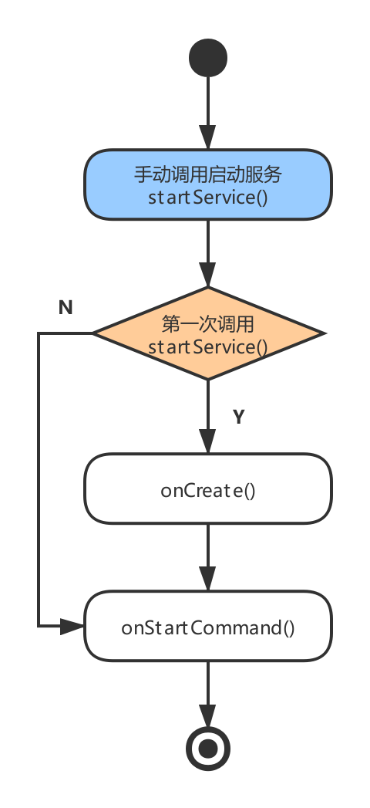
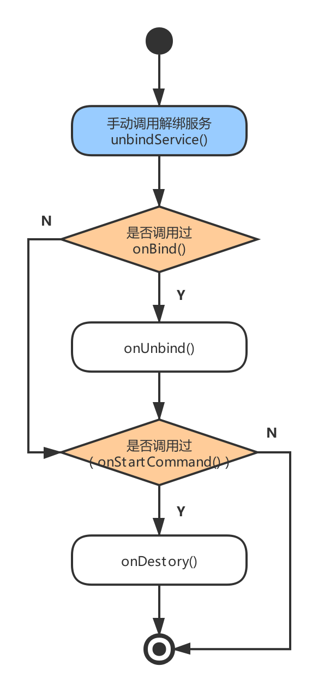
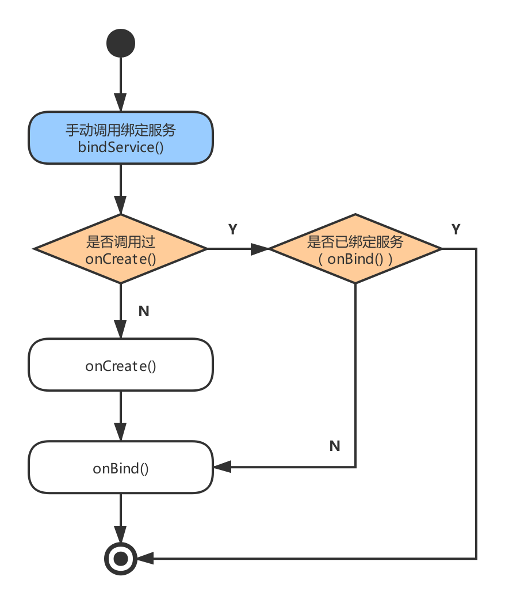

# 技术面试必备基础知识-Android

## 平台架构
### 参考资料
- [Gityuan. Android系统架构开篇. gityuan.com](http://gityuan.com/android/)
- [Deveplopers. Android 平台架构. developer.android.com](https://developer.android.com/guide/platform?hl=zh-cn)

|  |
| :-: |
| 图 1-1 Android 平台架构 |

#### Linux Kernel
- Android 平台的基础是 Linux 内核。例如 Android Runtime (ART) 依靠 Linux 内核来执行底层功能，比如 `线程` 和 `底层内存管理`。
- Linux 内核的安全机制为 Android 提供相应的保障，也允许设备制造商为内核开发硬件驱动程序。

#### Hardware Abstraction Layer
- 硬件抽象层 (HAL) 提供标准接口，HAL包含多个库模块，其中每个模块都为特定类型的硬件组件实现一组接口，比如 WIFI / 蓝牙模块，当框架 API 请求访问设备硬件时，Android 系统将为该硬件加载相应的库模块。

#### Android Runtime
- 对于运行 Android 5.0（API 级别 21）或更高版本的设备，每个应用都在其自己的进程中运行，并且有其自己的 Android Runtime (ART) 实例。ART 通过执行 DEX 文件在低内存设备上可运行多个 `虚拟机`。

	> DEX (Dalvik Executable，DEX) 文件是一种专为 Android 设计的字节码格式，经过优化使用内存很少。通常使用 Jack 编译器将 Java 源代码编译为 DEX 字节码。

- ART 的部分主要功能包括：
	- 预先 (AOT) 和即时 (JIT) 编译；
	- 优化的垃圾回收 (Gabarge Collection，GC)；
	- 支持将应用软件包中的 DEX 文件转换为更紧凑的机器代码；

		> 需 Android 9 (API 级别 28) 及更高版本的系统支持。
	
	- 更好的调试支持，包括专用采样分析器、详细的诊断异常和崩溃报告，并且能够设置观察点以监控特定字段。
- Android 还包含一套 `核心运行时库`，可提供 [Java API 框架](#Java-API-框架) 所使用的 Java 编程语言中的大部分功能，包括一些 Java 8 语言功能。

#### Nactive C/C++ Libraries
- 许多核心 Android 系统组件和服务（例如 ART 和 HAL）构建自原生代码，需要以 C / C++ 编写的原生库。

	> 例如，通过 Android 框架的 Java OpenGL API 访问 OpenGL ES，以支持在应用中绘制和操作 2D 和 3D 图形。

- 若开发需要 C / C++ 代码支持的应用，可使用 `Android NDK` 直接从原生代码访问某些原生平台库。

#### Java API Framework
- 您可通过以 Java 语言编写的 API 使用 Android OS 的整个功能集。这些 API 形成创建 Android 应用所需的构建块，它们可简化核心模块化系统组件和服务的重复使用，包括以下组件和服务：
	- `视图系统`：View System，用以构建应用的 UI，包括列表、网格、文本框、按钮甚至可嵌入的网络浏览器等。
	- `内容提供程序`：Content Provider，可让应用访问其他应用（例如“联系人”应用）中的数据或者共享其自己的数据。
	- `资源管理器`：Resource Manager，用于访问非代码资源，例如本地化的字符串、图形和布局文件。
	- `通知管理器`：Notification Manager，可让所有应用在状态栏中显示自定义提醒。
	- `活动管理器`：Activity Manager，用于管理应用的生命周期，提供常见的导航返回栈。

- 开发者可以完全访问 Android 系统应用使用的框架 [API](https://developer.android.com/reference/packages.html?hl=zh-cn)。

## 生命周期

### 参考资料
- [Carson_Ho. Service生命周期最全面解析. csdn.net](https://cloud.tencent.com/developer/article/1394219)
- [晕菜一员. Fragment生命周期及其正确使用 (建议使用自定义View替换Fragment). cnblogs.com](https://www.cnblogs.com/CharlesGrant/p/4876135.html)
- [JYGod. Android Fragment 非常详细的一篇. jianshu.com](https://www.jianshu.com/p/11c8ced79193)

### Activity 的生命周期

|  |
| :-: |
| 图 1-1 Activity 的完整生命周期 |

- 在系统中，触发 Activity 生命周期改变的方式：
	- 有用户参与的生命周期改变；
	- 系统回收或者配置修改导致的生命周期改变；
	
- 在 Activity 生命周期中，主要包含 6 种状态：
	- 6 种状态：onCreate()、onStart()、onResume()、onPause()、onStop()、onDestroy()。
	
		```java
		public class Activity extends ApplicationContext {
			protected void onCreate(Bundle savedInstanceState);
			protected void onStart();
			protected void onResume();
			protected void onPause();
			protected void onStop();
			protected void onDestory();
		}
		```
	
	- 6 种状态之间两两配对、有始有终，构成三组生命周期：完整的生命周期 (Entire Lifetime)、可视的生命周期 (Visible Lifetime) 以及前台的生命周期 (Foreground Lifetime)。
	
		- `完整的生命周期`：表示 Activity 组件从创建到销毁的全部过程，是最外层的生命周期。生命周期发生在调用 `onCreate()` 与调用 `onDestory()` 之间。
		
			> 注意：不能保证 onDestory() 被调用的时机。例如，Activity 在 Activity 栈中，当系统内存不足时则可能触发调用 onDestory() 方法强制销毁 Activity。
	
		- `可视的生命周期`：表示 Activity 组件 (当前屏幕看到的 Activity) 从用户可视到离开用户视线的全过程。生命周期发生在调用 `onStart()` 与调用 `onStop()` 之间。
		- `前台的生命周期`：表示 Activity 组件显示于其他 Activity 组件前，即位于 Activity 任务栈的栈顶，拥有最高优先级的资源使用权。生命周期发生在调用 `OnResume()` 与调用 `onPause()` 之间。

			> 在可视的生命周期中，Activity 组件可能位于 `全透明` 或者 `部分透明` 的 Acticity 下。前台状态必须位于全部的 Activity 之上。

	- onRestart()、onRestoreInstanceState() 和 onSaveInstanceState()：
		- onRestart()：当页面从 Activity 栈内调至栈顶时，会调用此方法，初次创建时不会调用。
		- onSaveInstanceState()：用于储存 Activity 的状态信息。
		- onRestoreInstanceState()：用于恢复 Activity 的状态信息。
	
			> 仅用于系统导致的页面重建，而用户导致的页面重建需在 onCreate() 中由开发者自主恢复状态信息。

### Service 的生命周期

|  |
| :-: |
| 图 1-2 Service 的完整生命周期 |

#### 生命周期常用方法
- 4 个手动调用的方法：

| 手动调用方法 | 作用 |
| :--- | :--- |
| startService()  | 启动服务 |
| stopService()   | 关闭服务 |
| bindService()   | 绑定服务 |
| unbindService() | 解绑服务 |

- 5 个自动调用的方法：

| 内部自动调用的方法 | 作用 |
| :--- | :--- |
| onCreate()         | 创建服务 |
| onStartCommand()   | 开始服务 |
| onDestroy()        | 销毁服务 |
| onBind()           | 绑定服务 |
| onUnbind()         | 解绑服务 |

#### 生命周期方法介绍
| 手动调用方法 | 活动图 | 作用 | 自动调用方法 | 备注 |
| :-: | :-: | :-: | :--- | :--- |
| startService() | 图 1-2-1 | 手动启动 Service | onCreate()<br>onStartCommand() | onStartCommand() 等于 onStartService() 的次数 |
| stopService() | 图 1-2-2 | 手动关闭 Service | onDestory() | 若 Service 被启动且绑定，在没有解绑前提下是无法使用 stopService() 停止服务的 |
| bindService() | 图 1-2-4 | 手动绑定 Service | onCreate()<br>onBind() | -- |
| unbindService() | 图 1-2-3 | 手动解绑 Service | oUnbind()<br>onDestory() | -- |

|  |  |
| :-: | :-: |
| 图 1-2-1 手动启动服务 startService() | 图 1-2-2 手动关闭服务 stopService() |
|  |  |
| 图 1-2-4 手动解绑服务 unbindService()  | 图 1-2-3 手动绑定服务 bindService() |

#### 常见生命周期使用
- 只使用 startService() 启动服务以及只使用 bindService() 绑定服务的生命周期，如图 1-2 所示。
- 同时使用 startService() 启动服务和 BindService() 绑定服务的生命周期，如图 1-2-5 所示。

	|  |
	| :-: |
	| 图 1-2-5 启动服务和绑定服务 |

- 需要注意的是：
	- startService() 和 stopService() 只能开启和关闭 Service，无法操作 Service； bindService() 和 unbindService() 可以操作 Service。
	- startService() 开启的 Service，调用者退出后 Service `仍然存在`；bindService() 开启的 Service，调用者退出后，Service `随着调用者销毁`。
	

### Fragment 的生命周期

|  |
| :-: |
| 图 1-3 Fragment 的完整生命周期 |

- Fragment 的基本概念：
	- Fragment 拥有自己的生命周期，且依赖于 Activity 而不能独立存在的。
	
		> Fragment 相当于一个有生命周期的 View，它的生命周期被所在的 Activity 的生命周期管理。
		
	- Activity 运行时，可以动态地添加或删除 Fragment。
	- Activity 可包含多个 Fragment，一个 Fragment 可被多个 Activity 重用。

- Fragment 的生命周期与 Activity 相仿：

	|  |
	| :-: |
	| 图 1-3-1 Fragment 与 Activity 生命周期的交互关系与顺序 |

	- onAttach()：在 Fragment 和 Activity 关联时调用，仅且调用一次。可以通过该方法获取 Activity 引用，还可以通过 getArguments() 获取参数。

	- onCreate()：在最初创建 Fragment 的时候会调用。

	- onCreateView()：在准备绘制 Fragment 界面时调用，返回值为 Fragment 要绘制布局的根视图，当然也可以返回 null。

		> onCreateView() 并不是一定会被调用，当添加的是没有界面的 Fragment 就不会调用，比如调用 FragmentTransaction.add() 方法。

	- onActivityCreated()：当 Activity 对象完成自己的 onCreate() 方法时调用。前提是 Activity 已经 created。

	- onStart()：Fragment 对用户可见时调用，前提是 Activity 已经 started。

	- onResume()：Fragment 可见，且与用户间可交互时调用，前提是 Activity 已经 resumed。

	- onPause()：Fragment 可见，但与用户间不可交互时会调用。宿主 Activity 对象转为 onPause 状态时调用。

	- onStop()：Fragment 不可见时会调用。宿主 Activity 对象转为 onStop 状态时调用。

	- onDestroyView()：在移除 Fragment 相关视图层级时调用。

	- onDestroy()：销毁 Fragment 时调用。

	- onDetach()：Fragment 和 Activity 解除关联时调用。

- 关于 Fragment 的依赖库版本选择问题： 
	- 建议使用 Support 库中的 `android.support.v4.app.Fragment`，而不要用系统自带的 `android.app.Fragment`。
	- 使用 Support 库的 Fragment，Activity 必须要继承 FragmentActivity (AppCompatActivity 是 FragmentActivity 的子类)。

## 通信方式